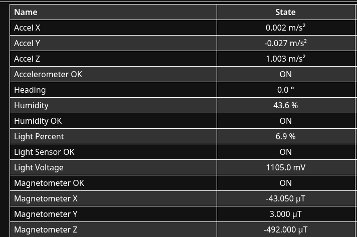
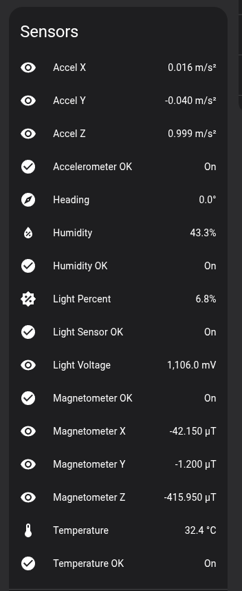

# Kiisu Sensor Hub

A simple refactor of [kiisu sensor hub by twoelw](https://github.com/twoelw/kiisu-sensor-hub) to show that you can export data to a esp32 running esphome connected to the kiisu. [Esphome config](./esphome.yaml) running on the esp32 sends a command with `data\n` and then reads the output and updates the sensors accordingly.

Licensed under Apache-2.0 like kiisu-sensor-hub, all driver code comes from twoelw and most of the code in `esphome_connect_app.c` also does. I only added some stuff to send the things over uart to the esp32 for displaying in homeassistant

## Features

- You get some sort of sensor data to home assistant

## Why

Yes

## Wiring

## Hass demo

## Goals

- Would love for someone to take this as inspiration to make it work with more of the sensors NFC would be very cool 